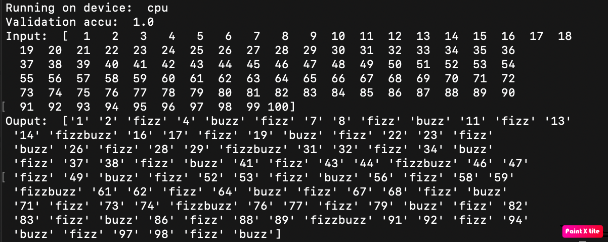

# PyTorch-Learning-101-Fizz-Buzz-Net
## A simple PyTorch project on fizz-buzz problem.

This is an simple project based on [Joel Grus' blog](https://joelgrus.com/2016/05/23/fizz-buzz-in-tensorflow/).

The original Tensorflow implementation is [here](https://github.com/joelgrus/fizz-buzz-tensorflow).

The docker file is [here](https://hub.docker.com/r/mengliuz88/pytorch-learning-101-fizz-buzz-net).

Run test.py to see the final result.

